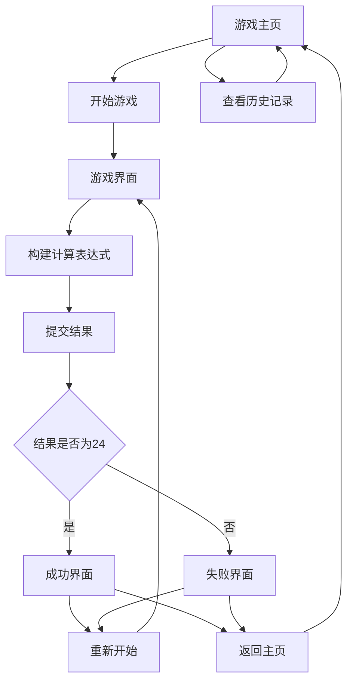

## 1. 产品概览
24点游戏是一款经典的数学益智游戏，玩家需要通过加减乘除四则运算，将给定的4个数字组合计算出结果为24。
- 产品旨在提高用户的数学计算能力和逻辑思维能力，适合各年龄段用户。
- 产品价值在于通过游戏化的方式，让用户在娱乐中学习，锻炼大脑。

## 2. 核心功能

### 2.1 用户角色
| 角色 | 注册方式 | 角色权限 |
|------|----------|----------|
| 普通用户 | 无需注册 | 可直接进行游戏，查看历史记录 |

### 2.2 功能模块
我们的24点游戏包含以下主要页面：
1. **游戏主页**：游戏标题、开始游戏按钮、规则说明、历史记录入口。
2. **游戏界面**：数字展示区、操作按钮区、计算结果展示区、重置按钮、提交按钮。
3. **结果界面**：游戏结果展示、重新开始按钮、返回主页按钮。
4. **历史记录**：历史游戏记录、最佳成绩、平均解题时间。

### 2.3 页面详情
| 页面名称 | 模块名称 | 功能描述 |
|----------|----------|----------|
| 游戏主页 | 游戏标题 | 展示游戏名称和logo |
| 游戏主页 | 开始游戏 | 点击进入游戏界面，开始新游戏 |
| 游戏主页 | 规则说明 | 展示游戏规则和玩法介绍 |
| 游戏主页 | 历史记录 | 查看历史游戏数据和成绩 |
| 游戏界面 | 数字展示区 | 展示随机生成的4个数字，每个数字只能使用一次 |
| 游戏界面 | 操作按钮区 | 提供数字按钮、运算符按钮（+、-、×、÷）、括号按钮、删除按钮 |
| 游戏界面 | 计算结果展示区 | 实时展示用户输入的计算表达式 |
| 游戏界面 | 重置按钮 | 清空当前输入，重新开始本轮游戏 |
| 游戏界面 | 提交按钮 | 提交计算结果，验证是否等于24 |
| 结果界面 | 游戏结果 | 展示游戏结果（成功/失败），成功时显示解题时间 |
| 结果界面 | 重新开始 | 点击开始新一轮游戏 |
| 结果界面 | 返回主页 | 点击返回游戏主页 |
| 历史记录 | 记录列表 | 展示历史游戏记录，包括日期、时间、结果、解题时间 |
| 历史记录 | 统计数据 | 展示最佳成绩、平均解题时间、总游戏次数等统计信息 |

## 3. 核心流程
用户游戏流程如下：
1. 用户进入游戏主页
2. 点击"开始游戏"按钮，进入游戏界面
3. 系统随机生成4个数字（1-13之间）
4. 用户通过点击数字按钮和运算符按钮，构建计算表达式
5. 用户点击"提交"按钮，系统验证计算结果
6. 系统判断结果是否等于24：
   - 如果等于24，显示成功界面，记录解题时间
   - 如果不等于24，显示失败界面
7. 用户可以选择"重新开始"或"返回主页"



## 4. 用户接口设计
### 4.1 设计风格
- 主色调：蓝色系（#4A90E2），代表智慧和冷静
- 辅助色：绿色（#50E3C2）用于成功状态，红色（#E53935）用于失败状态
- 按钮风格：圆角按钮，有轻微的阴影效果
- 字体：无衬线字体，大小适中，确保清晰可读
- 布局风格：居中布局，简洁明了，重点突出游戏区域
- 图标风格：简约现代，使用线性图标

### 4.2 页面设计概览
| 页面名称 | 模块名称 | UI元素 |
|----------|----------|--------|
| 游戏主页 | 整体布局 | 垂直居中布局，背景为浅色系，游戏标题使用大号字体，按钮使用主色调 |
| 游戏界面 | 数字展示区 | 4个数字卡片，每个卡片有边框和阴影，数字居中显示，字体较大 |
| 游戏界面 | 操作按钮区 | 网格布局，数字按钮和运算符按钮大小一致，运算符按钮使用不同颜色区分 |
| 游戏界面 | 计算结果展示区 | 顶部的输入框，显示当前输入的表达式，字体清晰 |
| 结果界面 | 结果展示 | 大号文字显示成功/失败，成功时配有绿色对勾图标，失败时配有红色叉号图标 |
| 历史记录 | 记录列表 | 表格形式展示，表头固定，记录可滚动查看 |

### 4.3 自适应
- 产品以PC端为主，支持响应式设计，适配不同屏幕尺寸
- 在移动设备上，操作按钮会自动调整大小和布局，确保良好的触摸体验
- 支持横屏和竖屏模式，在移动设备上自动适配

## 5. 技术栈
| 分类 | 技术 | 版本 | 选型理由 |
|------|------|------|----------|
| 前端框架 | Vue 3 | 3.4.0+ | 轻量高效，响应式设计，适合构建交互式游戏 |
| 构建工具 | Vite | 5.0.0+ | 快速的开发服务器和构建工具，支持热更新 |
| 状态管理 | Pinia | 2.1.0+ | 轻量级状态管理，适合管理游戏状态 |
| UI组件库 | Element Plus | 2.4.0+ | 提供丰富的UI组件，快速构建界面 |
| 数学计算 | math.js | 11.8.0+ | 用于解析和计算数学表达式 |
| 存储 | localStorage | 浏览器原生 | 用于存储游戏历史记录 |
| 测试 | Vitest | 0.34.0+ | 与Vite集成的测试框架，适合单元测试 |

## 6. 数据结构
### 6.1 游戏数据
```javascript
// 游戏状态
const gameState = {
  numbers: [2, 6, 8, 9], // 随机生成的4个数字
  usedNumbers: [false, false, false, false], // 标记数字是否被使用
  expression: "", // 当前输入的表达式
  isSolved: false, // 是否解决
  solveTime: 0, // 解题时间（秒）
  startTime: Date.now() // 开始时间
};

// 历史记录
const historyRecord = {
  id: "uuid",
  date: "2024-01-01",
  time: "12:00:00",
  numbers: [2, 6, 8, 9],
  solution: "(9 - 6) × (8 + 2)",
  solveTime: 45, // 解题时间（秒）
  isSuccess: true
};
```

## 7. 功能实现
### 7.1 核心算法
1. **数字生成**：随机生成4个1-13之间的数字
2. **表达式解析**：使用math.js解析用户输入的表达式
3. **结果验证**：验证计算结果是否等于24，且所有数字都被使用
4. **解题提示**：当用户请求提示时，提供一种可能的解法

### 7.2 关键功能实现
1. **游戏逻辑**：
   - 随机生成4个数字
   - 跟踪数字使用情况
   - 验证计算表达式
   - 记录解题时间

2. **历史记录**：
   - 存储游戏记录到localStorage
   - 展示历史记录列表
   - 计算统计数据

3. **用户界面**：
   - 响应式布局
   - 动画效果
   - 交互反馈

## 8. 验收标准
| 功能点 | 验收说明 | 测试方法 |
|--------|----------|----------|
| 游戏开始 | 点击开始游戏按钮后，随机生成4个数字 | 手动测试，点击开始游戏按钮，检查是否生成4个数字 |
| 数字输入 | 点击数字按钮，数字被添加到表达式中，且标记为已使用 | 手动测试，点击数字按钮，检查表达式和数字状态 |
| 运算符输入 | 点击运算符按钮，运算符被添加到表达式中 | 手动测试，点击运算符按钮，检查表达式 |
| 结果验证 | 提交表达式后，系统验证结果是否等于24 | 手动测试，输入正确和错误的表达式，检查验证结果 |
| 历史记录 | 游戏结束后，记录被保存到历史记录中 | 手动测试，完成游戏后，查看历史记录 |
| 响应式设计 | 在不同屏幕尺寸下，界面布局正常 | 手动测试，调整浏览器窗口大小，检查界面布局 |
| 解题提示 | 当用户请求提示时，提供正确的解法 | 手动测试，点击提示按钮，检查是否提供解法 |

## 9. 项目计划
| 阶段 | 任务 | 时间估计 |
|------|------|----------|
| 需求分析 | 分析产品需求，确定技术方案 | 1天 |
| 项目初始化 | 搭建项目框架，配置依赖 | 1天 |
| 核心功能开发 | 实现游戏逻辑，数字生成，表达式验证 | 3天 |
| UI开发 | 实现界面设计，响应式布局 | 2天 |
| 测试 | 功能测试，性能测试 | 1天 |
| 部署 | 构建和部署 | 1天 |

## 10. 风险评估
| 风险 | 影响程度 | 概率 | 应对措施 |
|------|----------|------|----------|
| 表达式解析错误 | 高 | 中 | 使用成熟的math.js库，增加错误处理 |
| 游戏难度过高 | 中 | 中 | 实现难度分级，根据用户水平调整数字范围 |
| 历史记录存储限制 | 低 | 低 | 限制历史记录数量，超过限制时自动清理旧记录 |
| 响应式布局问题 | 中 | 低 | 多设备测试，确保在不同屏幕尺寸下正常显示 |